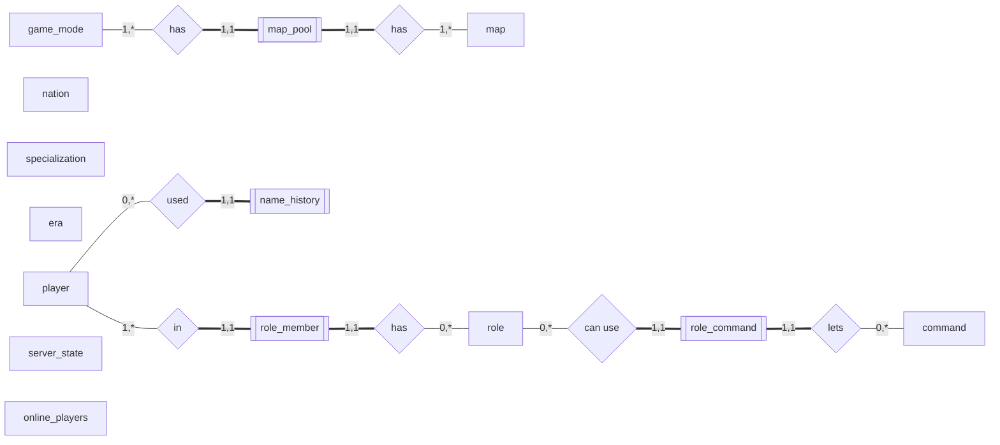

# Wargame bot database

game_mode(__id__, mode_name, server_name, starting_points, time_limit, score_limit, income_rate, game_mode, oposition, nation, era, theme, team_size, min_players, warmup_time, deploy_time, debrief_time, loading_time, password, auto_start, auto_rotate, map_vote, enable_commands)
map_pool(__mode_id__, __map_id__, name, income_rate, starting_points, score_limit, time_limit)
map(__id__, name, image, map_type, intended_size)
nation(__id__, name, code, emote_id)
specialization(__id__, name, code, emote_id)
era(__id__, name, code, emote_id)
player(__wargame_id__, discord_id, name)
name_history(__wargame_id__, name)
role(__id__, name)
role_member(__player_id__, __role_id__)
command(__name__)
role_command(__role_id__, __command_name__)
server_state(__id__, mode_id, map_id, state)
online_players(__player_id__, team)

## Wargame data (outdated)

| mode |  |
|:-|:-|
| __id__ | int |
| mode_name | string |
| server_name | string |
| starting_points | int |
| time_limit | int |
| score_limit | int |
| income_rate | int |
| game_mode | int |
| oposition | int |
| nations | int |
| era | int |
| theme | int |
| team_size | int |
| min_players | int |
| warmup_time | int |
| deploy_time | int |
| debrief_time | int |
| loading_time | int |
| auto_start | int |
| auto_rotate | int |
| map_vote | int |
| enable_commands | int |

| map_session |  |
|:-|:-|
| __mode_id__ | int |
| __mode_id__ | int |
| name | string |
| income_rate | int |
| init_money | int |
| score_limit | int |
| time_limit | int |

| map |  |
|:-|:-|
| __id__ | string |
| name | string |
| image | string |
| kind | string |
| intended_size | string |

| nation | |
|:-|:-|
| __id__ | int |
| name | string |
| code | string |
| emote_id | string |

| specializasion | |
|:-|:-|
| __id__ | int |
| name | string |
| code | string |
| emote_id | string |

| era | |
|:-|:-|
| __id__ | int |
| name | string |
| emote_id | string |

| wargame_Player |  |
|:-|:-:|
| __id__ | int |
| name | string |
| sessions | table |

| discord_Player |  |
|:- |:-:|
| __id__ | string |
| name | string |

| account_link |  |
|:- |:-:|
| __wargame_id__ | int |
| __discord_id__| int |
