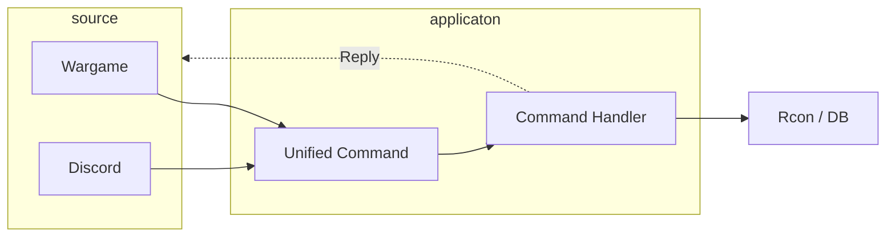

# Migration

Moving the application to use an internal database to store all the wargame data and player info instlad of my own (csv/json/yaml) files. To keep my own sanity and add some structure I am going to do thisusing the repository design pattern.

The app will the also be primed to implement in server chat commands for the next update. The logic flow of this looking something like this.

